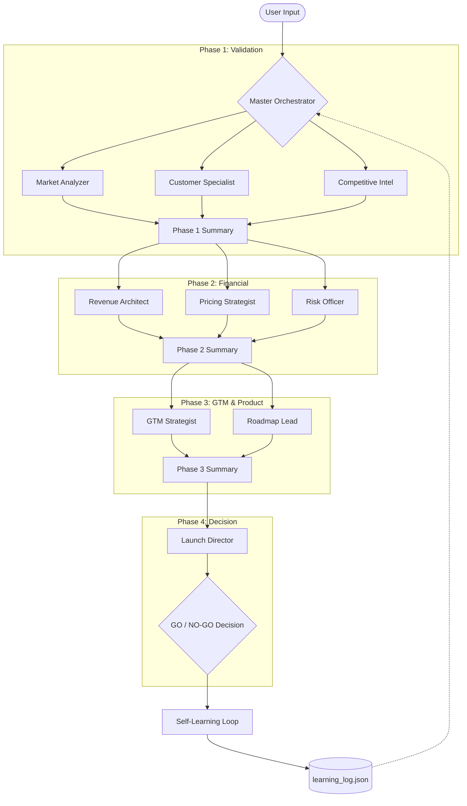

# 🐾 Venture Forge — Multi-Agent Product Launch OS

<div align="center">

**AI-powered multi-agent system that analyzes product ideas and delivers data-driven GO / NO-GO launch decisions**


</div>

---

## ✨ What is Venture Forge?

Venture Forge is an intelligent product launch operating system powered by **9 specialized AI agents** that work in parallel and sequence across **4 analysis phases** to evaluate your product idea end-to-end.

Instead of manual market research that takes weeks, Venture Forge provides a comprehensive analysis in minutes, backed by real-time financial data and competitive intelligence.

---

## 🔄 System Architecture & Flow

The following diagram illustrates how the **Master Orchestrator** manages the flow of information between specialized agents to reach a final launch decision.



---

## 🎯 Key Features

- 🤖 **9 Specialized AI Agents** — parallel + sequential orchestration via `asyncio`.
- 🧬 **Self-Learning Loop** — agents calibrate credibility via EMA (Exponential Moving Average) after each simulation.
- 📈 **Live Financial Data** — real-time competitor financials via **yFinance** (market cap, revenue, stock history).
- 🔍 **Google Trends Integration** — search interest data feeds into market analysis.
- 🧠 **Master Agent Chat** — conversational AI assistant with full simulation context.
- 📊 **Interactive Dashboard** — glassmorphism UI with Chart.js visualizations (market size, revenue projections, risk matrix).

---

## 💡 Dummy Use Case: "EcoEat"

To understand how Venture Forge works, let's follow a dummy product idea through the system:

**Product Idea:** *An AI-powered meal planning app that minimizes food waste by suggesting recipes based on items already in the user's fridge.*

### The Flow:
1.  **Input:** User enters "EcoEat", target audience "Environmentally conscious urban professionals", and business model "Premium Subscription".
2.  **Validation Phase:**
    *   **Market Analyzer:** Identifies a 15% CAGR in the sustainable food-tech sector.
    *   **Customer Specialist:** Maps out "Busy Brenda" who hates throwing away expensive organic produce.
3.  **Financial Phase:**
    *   **Revenue Architect:** Projects $1.2M ARR by year 2 based on a 3% conversion rate.
    *   **Risk Officer:** Flags "High Competition" from established players like HelloFresh.
4.  **Decision Phase:**
    *   **Launch Director:** Issues a **GO** decision with a **78% Confidence Score**, suggesting a "B2B partnership with grocery chains" to mitigate competition risk.
5.  **Learning Loop:** After the simulation, the system "simulates" market performance, adjusting the **Risk Officer's** credibility score because it accurately predicted the competitive hurdle.

---

## 🛠️ Tech Stack

| Layer | Technology |
|-------|-----------|
| **Backend** | Python 3.12, Flask, Flask-CORS |
| **AI/LLM** | Groq API — `llama-3.3-70b-versatile` |
| **Data APIs** | yFinance, Google Trends |
| **Frontend** | Vanilla JS, HTML5, CSS3, Chart.js |

---

## 🚀 Quick Start

### Prerequisites
- Python 3.9+
- [UV](https://docs.astral.sh/uv/) (recommended)

### Installation

```bash
# 1. Clone
git clone https://github.com/Krishhhhh05/Datadogs.git
cd Datadogs

# 2. Install dependencies
uv sync            # or: pip install -r requirements.txt

# 3. Set your API key in .env
echo "GROQ_API_KEY=your_key_here" > .env

# 4. Start the backend
uv run python backend/app.py
```

Open `frontend/app.html` in your browser to start.

---

## 🏗️ Project Structure

```
Datadogs/
├── backend/
│   ├── app.py                    # Flask API
│   ├── core/                     # Orchestration & Services
│   ├── agents/                   # The 9 Agent Definitions
│   └── data/                     # Persisted Learning Logs
├── frontend/                     # UI components (app.js, styles.css)
├── main.py                       # CLI version
└── run.sh                        # Startup script
```

---

## 🤝 Contributing
Contributions are welcome! Please feel free to submit a Pull Request.

## 📝 License
MIT License.

<div align="center">

**Made with ❤️ by Venture Forge**

</div>
